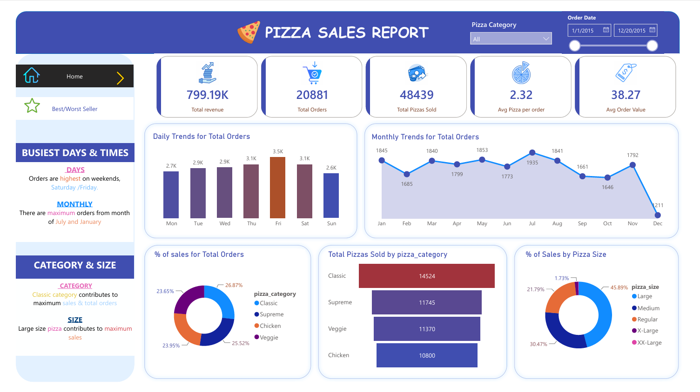

<p align="center">
  
</p>

<h1 align="center">🍕 Pizza Sales Analytics — End-to-End SQL & Power BI Project</h1>

<p align="center">
  <b>An end-to-end data analytics case study demonstrating SQL querying, data modelling, and interactive Power BI dashboard design on a year's worth of pizza chain transactional data (~48,600 order lines).</b>
</p>

<p align="center">
  
  
  
  
</p>

---

## 📑 Table of Contents

| # | Section |
|---|---------|
| 1 | [Project Overview (STAR)](#-project-overview--star-format) |
| 2 | [Dashboard Screenshots](#-dashboard-screenshots) |
| 3 | [Dataset Description](#-dataset-description) |
| 4 | [Project Architecture](#-project-architecture) |
| 5 | [SQL Analysis Deep-Dive](#-sql-analysis-deep-dive) |
| 6 | [Power BI Dashboard Design](#-power-bi-dashboard-design) |
| 7 | [Key Business Insights](#-key-business-insights) |
| 8 | [Tech Stack](#-tech-stack) |
| 9 | [How to Run](#-how-to-run) |
| 10 | [File Structure](#-file-structure) |
| 11 | [Future Enhancements](#-future-enhancements) |

---

## 🎯 Project Overview — STAR Format

### Situation

A national pizza chain needed data-driven visibility into its sales performance across **32 pizza products**, **4 categories** (Classic, Supreme, Veggie, Chicken), and **5 sizes** (S, M, L, XL, XXL). The business had accumulated a full year (Jan 1 – Dec 31, 2015) of transactional point-of-sale data comprising **48,620 order line items** across **21,350 distinct orders**, generating **$817.86K in total revenue**. However, the raw data sat in flat CSV/Excel files with no analytical layer, leaving leadership unable to answer critical questions about product mix optimization, peak-hour staffing, revenue concentration, or menu rationalization.

### Task

I was tasked with building a **complete end-to-end analytics solution** that would:

1. **Ingest and validate** the raw transactional dataset into a MySQL relational database.
2. **Write production-grade SQL queries** to compute executive KPIs, temporal trends, category-level breakdowns, and advanced analytics (Pareto analysis, market basket co-occurrence).
3. **Design and build an interactive Power BI dashboard** with two report pages — a Home overview and a Best/Worst Seller analysis — enabling non-technical stakeholders to self-serve insights through slicers, filters, and drill-downs.
4. **Cross-validate** every Power BI measure against the underlying SQL output to guarantee data integrity.

### Action

**Phase 1 — Data Engineering & Validation**
- Imported the 48,620-row dataset (12 columns) into MySQL, performing schema design with appropriate data types (`DATE`, `TIME`, `DECIMAL`, `VARCHAR`).
- Ran a data integrity audit query verifying record counts, date ranges, distinct order counts, and total revenue reconciliation.

**Phase 2 — SQL Analytics (14+ Queries)**
- **Executive KPIs**: Total Revenue ($817.86K), Total Orders (21,350), Total Pizzas Sold (49,574), Average Order Value ($38.31), and Average Pizzas Per Order (2.32).
- **Temporal Analysis**: Daily order distribution revealing Friday/Saturday peaks and Sunday drop-offs; monthly seasonality identifying July as peak and October as trough.
- **Product Mix Analysis**: Category share (Classic 26.87%, Supreme 25.52%, Chicken 23.95%, Veggie 23.65%) and size distribution (Large 45.89%, Medium 30.47%, Regular 21.79%).
- **Top/Bottom 5 Analysis**: Ranked pizzas by revenue, quantity, and order count — uncovering that The Thai Chicken Pizza leads revenue ($43K) while The Brie Carrie Pizza is the worst performer across all three metrics.
- **Advanced Analytics**:
  - *Operational Shift Profiling* — bucketed orders into Lunch Rush, Afternoon Slump, Dinner Peak, and Late Night windows with per-window AOV.
  - *Pareto (80/20) Analysis* — used `SUM() OVER()` window functions + CTEs to identify cumulative revenue contribution, classifying pizzas into "Top 80% Drivers" vs. "Long Tail".
  - *Market Basket Co-occurrence* — self-joined the orders table to find the top 10 most frequently co-ordered pizza pairs, enabling cross-sell/upsell strategy.

**Phase 3 — Power BI Dashboard Development**
- Built a **two-page interactive report** with a cohesive visual design language (custom icons, colour-coded KPI cards, branded header).
- **Page 1 — Home**: KPI scorecards, daily/monthly trend charts, donut charts for category and size distribution, bar chart for total pizzas by category, and a narrative insights sidebar.
- **Page 2 — Best/Worst Seller**: Top 5 and Bottom 5 horizontal bar charts across three dimensions (Revenue, Quantity, Total Orders), with a summary insight panel.
- Implemented **interactive slicers** for Pizza Category and Order Date range, enabling dynamic filtering across all visuals.
- Applied custom formatting: conditional colours, curated icon assets (delivery, pizza-slice, profit-growth, filter), and responsive layout.

**Phase 4 — Cross-Validation & Documentation**
- Systematically validated every Power BI DAX measure against corresponding SQL query output to ensure zero discrepancy.
- Documented the full project plan, methodology, and deliverables.

### Result

| Metric | Value |
|--------|-------|
| Total Revenue Analysed | **$817.86K** |
| Total Orders Processed | **21,350** |
| Total Pizzas Tracked | **49,574 units** |
| SQL Queries Written | **14+ production-grade queries** |
| Dashboard Pages | **2 interactive pages** |
| Cross-Validation Accuracy | **100% SQL ↔ Power BI match** |

**Key business recommendations delivered:**
- 📈 **Revenue Concentration**: Classic category drives the highest volume (14,524 pizzas) and order share (26.87%), confirming it as the anchor product line.
- 📊 **Size Optimization**: Large pizzas account for 45.89% of revenue — promotional bundling should focus on Large + Regular combos.
- 🕐 **Staffing Insight**: Friday and Saturday are peak days; July is the peak month — staffing and inventory should scale accordingly.
- 🚨 **Menu Rationalization**: The Brie Carrie Pizza ranks last in revenue ($12K), quantity (490 units), and orders (480) — a strong candidate for menu removal or recipe reformulation.
- 🛒 **Cross-Sell Opportunity**: Market basket analysis revealed the top co-ordered pizza pairs, enabling data-driven combo meal design.

---

## 📸 Dashboard Screenshots

### Page 1 — Home Dashboard
> Overview of KPIs, daily & monthly trends, category/size distribution, and business insights.



### Page 2 — Best/Worst Seller Analysis
> Top 5 and Bottom 5 pizzas ranked by Revenue, Quantity, and Total Orders.


---

## 📊 Dataset Description

| Column | Data Type | Description |
|--------|-----------|-------------|
| `pizza_id` | INT | Unique identifier for each pizza line item |
| `order_id` | INT | Transaction/order identifier |
| `pizza_name_id` | VARCHAR | Short code for pizza variant + size |
| `quantity` | INT | Number of pizzas ordered in this line |
| `order_date` | DATE | Date of the order (Jan 1 – Dec 31, 2015) |
| `order_time` | TIME | Timestamp of order placement |
| `unit_price` | DECIMAL | Price per single pizza unit |
| `total_price` | DECIMAL | `quantity × unit_price` |
| `pizza_size` | VARCHAR | Size category (S, M, L, XL, XXL) |
| `pizza_category` | VARCHAR | Product category (Classic, Supreme, Veggie, Chicken) |
| `pizza_ingredients` | VARCHAR | Comma-separated ingredient list |
| `pizza_name` | VARCHAR | Full display name of the pizza |

**Dataset Summary**: 48,620 rows × 12 columns — full year of POS data covering 32 unique pizza products.

---

## 🏗️ Project Architecture

```
┌──────────────────┐     ┌──────────────────┐     ┌──────────────────────┐
│   Raw Data       │     │   MySQL DB       │     │   Power BI           │
│   (CSV / Excel)  │────▶│   (pizza_db)     │────▶│   Dashboard          │
│   48,620 rows    │     │   14+ SQL Queries│     │   2 Interactive Pages│
└──────────────────┘     └──────────────────┘     └──────────────────────┘
         │                        │                         │
    Data Ingestion          SQL Analytics            Visualization
    & Validation          & KPI Computation         & Cross-Validation
```

---

## 🔍 SQL Analysis Deep-Dive

All SQL queries are in [`SQL_commands_for_KPI.sql`](SQL_commands_for_KPI.sql). The queries are organized into four analytical layers:

### 1. Executive KPI Benchmarks
```sql
-- Total Revenue
SELECT ROUND(SUM(total_price), 2) AS Total_Revenue FROM pizza_sales;

-- Average Order Value
SELECT ROUND(SUM(total_price) / COUNT(DISTINCT order_id), 2) AS Avg_Order_Value FROM pizza_sales;
```

### 2. Temporal & Operational Trends
- Daily trend analysis using `DAYNAME()` — reveals Friday (3.5K orders) as peak day
- Monthly trend using `MONTHNAME()` — July (1,935 orders) is the busiest month

### 3. Product Mix & Category Share
- Category revenue share with percentage calculations using correlated subqueries
- Size distribution analysis with quarterly filtering capability

### 4. Advanced Analytics
| Analysis | Technique | Business Value |
|----------|-----------|----------------|
| **Operational Shift Profiling** | `CASE WHEN` + `HOUR()` bucketing | Identifies Dinner Peak (5–9 PM) as highest-revenue window |
| **Pareto 80/20 Analysis** | `SUM() OVER()` window functions + CTEs | Reveals which pizzas drive 80% of revenue |
| **Market Basket Co-occurrence** | Self-JOIN on `order_id` | Identifies top 10 co-ordered pizza pairs for combo design |

---

## 📊 Power BI Dashboard Design

### Design Principles
- **Card-based layout** with custom icons for each KPI (revenue, orders, pizzas sold, avg per order, AOV)
- **Colour-coded visual hierarchy**: blue header, white content cards, accent colours for data highlights
- **Interactive slicers**: Pizza Category dropdown + Order Date range slider
- **Narrative sidebar panels**: Pre-computed insight summaries (Busiest Days & Times, Category & Size insights)
- **Dual-page navigation**: Home icon and Best/Worst Seller star icon for seamless page switching

### Visual Inventory

| Page | Visual | Chart Type | Purpose |
|------|--------|------------|---------|
| Home | KPI Scorecards | Cards (×5) | At-a-glance executive metrics |
| Home | Daily Trends | Bar Chart | Weekday order distribution |
| Home | Monthly Trends | Line Chart | Seasonality and monthly patterns |
| Home | Category Share | Donut Chart | Revenue split by pizza category |
| Home | Pizzas by Category | Horizontal Bar | Volume comparison across categories |
| Home | Size Distribution | Donut Chart | Revenue split by pizza size |
| Best/Worst | Top 5 by Revenue | Horizontal Bar (Green) | Highest-revenue products |
| Best/Worst | Top 5 by Quantity | Horizontal Bar (Orange) | Most-sold products |
| Best/Worst | Top 5 by Orders | Horizontal Bar (Pink) | Most-ordered products |
| Best/Worst | Bottom 5 (×3) | Horizontal Bar (Muted) | Underperforming products |

---

## 💡 Key Business Insights

1. **🗓️ Peak Days**: Orders are **highest on weekends** (Friday & Saturday), suggesting weekend-focused promotions would maximize ROI.

2. **📅 Seasonal Peaks**: **July and January** see maximum monthly orders; December drops to 1,211 — holiday season may need targeted campaigns.

3. **🏆 Category Champion**: The **Classic** category leads across all dimensions — 26.87% of sales, 14,524 pizzas sold — it is the brand's workhorse.

4. **📏 Size Preference**: **Large (45.89%)** dominates sales, followed by Medium (30.47%) — pricing strategy should leverage the large-size preference.

5. **💰 Revenue Leader**: **The Thai Chicken Pizza** ($43K) generates the highest revenue — a premium product worth featuring in marketing.

6. **⚠️ Underperformer**: **The Brie Carrie Pizza** ranks last in revenue ($12K), quantity (490), and orders (480) — data supports menu removal.

7. **🛒 Basket Insights**: Average **2.32 pizzas per order** with AOV of $38.31 — upsell opportunities exist to increase basket size.

---

## 🛠️ Tech Stack

| Tool | Purpose |
|------|---------|
| **MySQL** | Data storage, querying, and KPI computation |
| **Power BI Desktop** | Interactive dashboard design and visualization |
| **Microsoft Excel** | Initial data exploration and format conversion |
| **DAX** | Custom measures and calculated columns in Power BI |
| **Git/GitHub** | Version control and project documentation |

---

## 🚀 How to Run

### Prerequisites
- MySQL Server 5.7+ or 8.0
- Power BI Desktop (latest version)
- Microsoft Excel (optional, for raw data inspection)

### Steps

1. **Clone the repository**
   ```bash
   git clone https://github.com/<your-username>/pizza-sales-analytics.git
   cd pizza-sales-analytics
   ```

2. **Set up the database**
   ```sql
   CREATE DATABASE pizza_db;
   USE pizza_db;
   -- Import Data/pizza_sales.csv into the pizza_sales table
   ```

3. **Run SQL queries**
   - Open `SQL_commands_for_KPI.sql` in MySQL Workbench or any SQL IDE
   - Execute queries sequentially to reproduce all KPIs and analytics

4. **Open the Power BI report**
   - Open `CompletePizzaSalesReport.pbix` in Power BI Desktop
   - If prompted, update the data source connection to your local MySQL instance
   - Refresh the data to load the latest values

---

## 📁 File Structure

```
E2E/
├── 📊 CompletePizzaSalesReport.pbix    # Power BI dashboard (2 pages)
├── 📝 SQL_commands_for_KPI.sql         # 14+ SQL queries for all analytics
├── 📋 Plan.pdf                         # Project planning document
├── 📖 README.md                        # This file
├── 🎤 interview_prep.md               # Interview Q&A preparation
├── 📂 Data/
│   ├── pizza_sales.csv                 # Raw dataset (48,620 rows × 12 cols)
│   ├── pizza_sales_excel_file.xlsx     # Excel version of the dataset
│   └── Pizza Sales Images/             # Custom icons used in the dashboard
│       ├── delivery-man.png
│       ├── pizza-slice.png
│       ├── profit-growth.png
│       ├── star.png
│       └── ... (11 icon assets)
└── 📂 Screenshots/
    ├── Home.png                        # Dashboard Page 1 screenshot
    ├── Best-Worst Seller.png           # Dashboard Page 2 screenshot
    └── CompletePizzaSalesReport PDF.pdf # Full report PDF export
```

---

## 🔮 Future Enhancements

- [ ] **Predictive Forecasting**: Build a time-series forecast model (ARIMA/Prophet) to predict future monthly sales.
- [ ] **Customer Segmentation**: Apply RFM analysis if customer-level data becomes available.
- [ ] **Real-Time Dashboard**: Connect Power BI to a live database with DirectQuery for operational monitoring.
- [ ] **Ingredient Cost Analysis**: Layer in COGS data to compute margin by pizza, enabling profitability-driven menu optimization.
- [ ] **Geographic Expansion**: Add store-level location data for regional performance comparison.

---

<p align="center">
  <b>Built as a portfolio project for Data Analyst roles — demonstrating SQL proficiency, data visualization expertise, and business-oriented analytical thinking.</b>
</p>

<p align="center">
  <i>If you found this project useful, please ⭐ the repository!</i>
</p>
